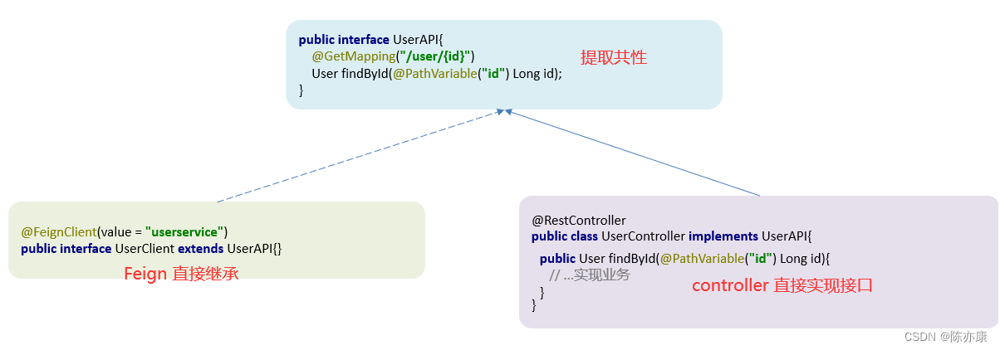
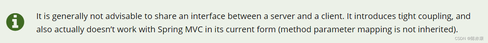
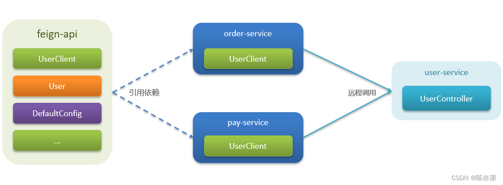

## Feign 的最佳实践

### 方式一
给消费者的FeignClient和提供者的controller定义统一的父接口作为标准。

仔细观察我们可以发现， Feign 发起远程调用的接口和接收远程调用请求的 controller 层实现代码是一样的，因此，我们我可以把他们的共性提取出来，写成一个公开的接口，将来我们使用的时候只需要继承这个接口即可。但这种方式存在一定的问题，以下是官方提出的问题：

也就是说

* 服务紧耦合
* 不适用于 Spring MVC （父接口参数列表中的映射不会被继承）

### 方式二
将FeignClient抽取为独立模块，并且把接口有关的POJO（实体类）、默认的Feign配置都放到这个模块中，提供给所有消费者使用

